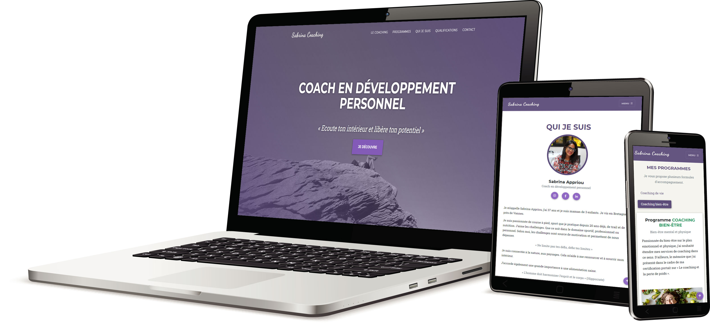

<!-- PROJECT LOGO -->
 

  <h3 align="center">Sabrina Coaching website project</h3>

  

    A website that presents the activity of Sabrina Appriou, personal development coach.
     
    <a href="https://github.com/antoinebollinger/sabrinaappriou.com/issues">🐛 Report Bug</a>
  

<!-- TABLE OF CONTENTS -->

  
Table of Contents

  <ul>
    <li>
      <a href="#about-the-project-">About The Project 👈</a>
      <ul>
        <li><a href="#preview">Preview</a></li>
        <li><a href="#build-with">Build with</a></li>
      </ul>
    </li>
    <li><a href="#contact-">Contact 📧</a></li>
  </ul>

<!-- ABOUT THE PROJECT -->

## About The Project 👈

### Preview

### Build with

The project is based on a free template from [Start Boostrap](https://startbootstrap.com/).

I used the [Webpack](https://webpack.js.org/) package to manage my **JS** code. This allowed me to work with modules and classes.

The website is currently tested on a [Netlify](https://www.netlify.com/) deployment. You can see the result at [Sabrina Coaching](https://sabrinaappriou.netlify.app/).

<!-- CONTACT -->

## Contact 📧

Antoine Bollinger - [LinkedIn](https://www.linkedin.com/in/antoinebollinger/) - antoine.bollinger@gmail.fr